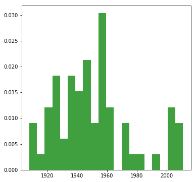

Lets import the required libraries that we will be using later. 


```python
from numpy import *
import pandas as pd 
```

Let's load the dataset into a pandas dataframe and have a look at the headers.


```python
df = pd.read_csv('data.csv')

print len(df)    # print number of rows
print list(df)   # print headers
```

    99
    ['parcelid', 'airconditioningtypeid', 'architecturalstyletypeid', 'basementsqft', 'bathroomcnt', 'bedroomcnt', 'buildingclasstypeid', 'buildingqualitytypeid', 'calculatedbathnbr', 'decktypeid', 'finishedfloor1squarefeet', 'calculatedfinishedsquarefeet', 'finishedsquarefeet12', 'finishedsquarefeet13', 'finishedsquarefeet15', 'finishedsquarefeet50', 'finishedsquarefeet6', 'fips', 'fireplacecnt', 'fullbathcnt', 'garagecarcnt', 'garagetotalsqft', 'hashottuborspa', 'heatingorsystemtypeid', 'latitude', 'longitude', 'lotsizesquarefeet', 'poolcnt', 'poolsizesum', 'pooltypeid10', 'pooltypeid2', 'pooltypeid7', 'propertycountylandusecode', 'propertylandusetypeid', 'propertyzoningdesc', 'rawcensustractandblock', 'regionidcity', 'regionidcounty', 'regionidneighborhood', 'regionidzip', 'roomcnt', 'storytypeid', 'threequarterbathnbr', 'typeconstructiontypeid', 'unitcnt', 'yardbuildingsqft17', 'yardbuildingsqft26', 'yearbuilt', 'numberofstories', 'fireplaceflag', 'structuretaxvaluedollarcnt', 'taxvaluedollarcnt', 'assessmentyear', 'landtaxvaluedollarcnt', 'taxamount', 'taxdelinquencyflag', 'taxdelinquencyyear', 'censustractandblock']


    0     10754147
    1     10759547
    2     10843547
    3     10859147
    4     10879947
    5     10898347
    6     10933547
    7     10940747
    8     10954547
    9     10976347
    10    11073947
    11    11114347
    12    11116947
    13    11142747
    14    11193347
    15    11215747
    16    11229347
    17    11287347
    18    11288547
    19    11324547
    20    11391347
    21    11395747
    22    11404347
    23    11405747
    24    11417147
    25    11457547
    26    11488147
    27    11520747
    28    11524947
    29    11544747
            ...   
    69    12077147
    70    12104147
    71    12111347
    72    12144747
    73    12167947
    74    12168547
    75    12171147
    76    12188547
    77    12195547
    78    12209347
    79    12211747
    80    12228547
    81    12254347
    82    12257147
    83    12310147
    84    12311747
    85    12322547
    86    12360147
    87    12366747
    88    12371547
    89    12378747
    90    12405147
    91    12408747
    92    12446947
    93    12476147
    94    12508747
    95    12537947
    96    12549947
    97    12559547
    98    12559747
    Name: parcelid, dtype: int64


Next, lets look at a specific column or feature in the dataframe.


```python
print "bedroom:", df.bedroomcnt.unique()
print "bathroom:", df.bathroomcnt.unique()
```

    bedroom: [ 0.  4.  5.  2.  3.]
    bathroom: [ 0.  2.  4.  3.]


Lets drop some columns that are known to hold no data. 


```python
df = df.drop('airconditioningtypeid', 1)
df = df.drop('architecturalstyletypeid', 1)
```

What is the max, min, mean/avg, and standard deviation of the column 'bedroomcnt'?


```python
print "Min bedroom cnt: " , min(df['bedroomcnt'])
print "Max bedroom cnt: " , max(df['bedroomcnt'])
print "Std bedroom cnt: " , df['bedroomcnt'].std()
print "Avg bedroom cnt: " , df['bedroomcnt'].mean()


```

    Min bedroom cnt:  0.0
    Max bedroom cnt:  5.0
    Std bedroom cnt:  1.00462751199
    Avg bedroom cnt:  0.30303030303


Plot the distribution of 'yearbuild' using matplotlib


```python
import matplotlib.mlab as mlab
import matplotlib.pyplot as plt
import numpy as np

# remove NAN from array
x = df['yearbuilt'][~np.isnan(df['yearbuilt'])]

# plot histogram 
n, bins, patches = plt.hist(x, 20, normed=1, facecolor='green', alpha=0.75)
plt.show()
```





One of the best ways to inspect data is visualize it. One way to do this is by using a scatter plot. A scatter plot of the data puts one feature along the x-axis and another along the y-axis, and draws a dot for each data point. 

Since its difficult to visualize more than 2 or 3 features, one possibility is to use a pair plot that looks at all possible pairs of features. The pair plot shows the interaction of each pair of features inorder to visualize any correlation between features. 
