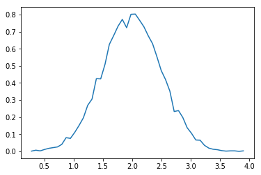

# Numpy

Provides various utilities functions on top of N-dimensional array such statistical calculation (.mean(), .std()) and vectorized operation.

A numpy array is a N-dimensional array, all of the same type, and is indexed by nonnegative integers. The number of dimensions is the rank of the array; the shape of an array is a tuple of integers giving the size of the array along each dimension.

We can initialize numpy arrays from nested Python lists, and access elements using square brackets:


```python
from numpy import *

a = arange(15).reshape(3, 5)
print a

print "Type of a:", type(a)
print "Shape of a:", a.shape
print "# dimensions:", a.ndim
print "datatype of elements in a:", a.dtype.name
print "# of elements:", a.size

b = array([6,7,8])
print "Type of b:", type(b)

print "1st elem in b:", b[0] # print first element in b 
```

    [[ 0  1  2  3  4]
     [ 5  6  7  8  9]
     [10 11 12 13 14]]
    Shape of a: (3, 5)
    # dimensions: 2
    datatype of elements in a: int64
    # of elements: 15
    Type of a: <type 'numpy.ndarray'>
    Type of b: <type 'numpy.ndarray'>


### Array creation
Numpy also provides many functions to create arrays. You can also read more about array creation here : https://docs.scipy.org/doc/numpy/user/basics.creation.html#arrays-creation


```python
a = np.zeros((2,2))   # Create an array of all zeros
print "a:\n", a

b = np.ones((1,2))    # Create an array of all ones
print "b:\n", b

c = np.full((2,2), 7)  # Create an array with a constant
print "c:\n", c

d = np.eye(2)         # Create a 2x2 identity matrix
print "d:\n", d

e = np.random.random((2,2))  # Create an array filled with random values
print "e:\n", e
```

    a:
    [[ 0.  0.]
     [ 0.  0.]]
    b:
    [[ 1.  1.]]
    c:
    [[ 7.  7.]
     [ 7.  7.]]
    d:
    [[ 1.  0.]
     [ 0.  1.]]
    e:
    [[ 0.06939502  0.98031338]
     [ 0.71210968  0.31308969]]


###Array indexing 

Numpy offers several ways to index into arrays.

Slicing: Similar to Python lists, numpy arrays can be sliced. Since arrays may be multidimensional, you must specify a slice for each dimension of the array:


```python
# Create the following rank 2 array with shape (3, 4)
# [[ 1  2  3  4]
#  [ 5  6  7  8]
#  [ 9 10 11 12]]
a = np.array([[1,2,3,4], [5,6,7,8], [9,10,11,12]])

# Use slicing to pull out the subarray consisting of the first 2 rows
# and columns 1 and 2; b is the following array of shape (2, 2):
# [[2 3]
#  [6 7]]
b = a[:2, 1:3]

# A slice of an array is a view into the same data, so modifying it
# will modify the original array.
print(a[0, 1])   # Prints "2"
b[0, 0] = 77     # b[0, 0] is the same piece of data as a[0, 1]
print(a[0, 1])   # Prints "77"
```

You can also mix integer indexing with slice indexing. However, doing so will yield an array of lower rank than the original array. 


```python
# Create the following rank 2 array with shape (3, 4)
# [[ 1  2  3  4]
#  [ 5  6  7  8]
#  [ 9 10 11 12]]
a = np.array([[1,2,3,4], [5,6,7,8], [9,10,11,12]])

# Two ways of accessing the data in the middle row of the array.
# Mixing integer indexing with slices yields an array of lower rank,
# while using only slices yields an array of the same rank as the
# original array:
row_r1 = a[1, :]    # Rank 1 view of the second row of a
row_r2 = a[1:2, :]  # Rank 2 view of the second row of a
print(row_r1, row_r1.shape)  # Prints "[5 6 7 8] (4,)"
print(row_r2, row_r2.shape)  # Prints "[[5 6 7 8]] (1, 4)"

# We can make the same distinction when accessing columns of an array:
col_r1 = a[:, 1]
col_r2 = a[:, 1:2]
print(col_r1, col_r1.shape)  # Prints "[ 2  6 10] (3,)"
print(col_r2, col_r2.shape)  # Prints "[[ 2]
                             #          [ 6]
                             #          [10]] (3, 1)"
```

### Array math
Basic mathematical functions operate elementwise on arrays, and are available both as operator overloads and as functions in the numpy module:


```python
x = np.array([[1,2],[3,4]], dtype=np.float64)
y = np.array([[5,6],[7,8]], dtype=np.float64)

# Elementwise sum; both produce the array
print "matrix sum:\n", x + y
print "matrix sum:\n", add(x, y)

# Elementwise difference; both produce the array
print "matrix difference:\n", x - y
print "matrix difference:\n", subtract(x, y)

# Elementwise product; both produce the array
print "matrix prodcut:\n", x * y
print "matrix prodcut:\n", multiply(x, y)

# Elementwise division; both produce the array
print "matrix division:\n", x / y
print "matrix division:\n", divide(x, y)

# Elementwise square root; produces the array
print "square root:\n", sqrt(x)

# Elementwise product by scaler
print "matrix by scaler:\n", x * 2

```

    matrix sum:
    [[  6.   8.]
     [ 10.  12.]]
    matrix sum:
    [[  6.   8.]
     [ 10.  12.]]
    matrix difference:
    [[-4. -4.]
     [-4. -4.]]
    matrix difference:
    [[-4. -4.]
     [-4. -4.]]
    matrix prodcut:
    [[  5.  12.]
     [ 21.  32.]]
    matrix prodcut:
    [[  5.  12.]
     [ 21.  32.]]
    matrix division:
    [[ 0.2         0.33333333]
     [ 0.42857143  0.5       ]]
    matrix division:
    [[ 0.2         0.33333333]
     [ 0.42857143  0.5       ]]
    square root:
    [[ 1.          1.41421356]
     [ 1.73205081  2.        ]]
    matrix by scaler:
    [[ 2.  4.]
     [ 6.  8.]]


### Linear algebra operations 


```python
A = array( [[1,1], [0,1]] )
B = array( [[2,0], [3,4]] )

print "A*B:\n", A*B # elementwise product 

print "dot(A,B):\n", dot(A,B) # matrix product

a = ones((2,3), dtype=int) # create matrix all 1s of size 2 x 3
b = random.random((2,3)) # create matrix of size 2 x 3, randomly

a *= 3 # multiply each element by 3
print "a:\n", a

b += a  # add two matrices, and assign to matrix b
print "b\n:", b
```

    A*B:
    [[2 0]
     [0 4]]
    dot(A,B):
    [[5 4]
     [3 4]]
    a:
    [[3 3 3]
     [3 3 3]]
    b
    : [[ 3.51665755  3.15221622  3.896464  ]
     [ 3.42767488  3.25868986  3.42485715]]


```python
a = random.random((2,3))

print "matrix a:\n", a

print "sum:\n", a.sum()
print "min:\n",a.min()
print "max:\n",a.max()

```

    matrix a:
    [[ 0.59257921  0.72241258  0.32824592]
     [ 0.67982578  0.71641435  0.02639753]]
    sum:
    3.06587536152
    min:
    0.0263975324349
    max:
    0.722412578383


```python
# show histogram of elements in array 
import numpy
import pylab

# Build a vector of 10000 normal deviates with variance 0.5^2 and mean 2
mu, sigma = 2, 0.5
v = numpy.random.normal(mu,sigma,10000)
print "v:", v

# Plot a normalized histogram with 50 bins
pylab.hist(v, bins=50, normed=1)       # matplotlib version (plot)
pylab.show()

# Compute the histogram with numpy and then plot it
(n, bins) = numpy.histogram(v, bins=50, normed=True)  # NumPy version (no plot)
pylab.plot(.5*(bins[1:]+bins[:-1]), n)
pylab.show()
```

    v: [ 1.5313893   1.64101043  2.08524406 ...,  1.90037084  2.06093174
      2.38886047]




